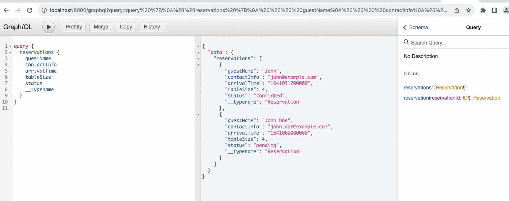

## architecture design
- Monorepo + npm single warehouse multi-project dependent shared architecture design

### font-end
- React + apollo
= operation: npm run start

### back-end
- express + graphql
= operation: npm run start

### database
- docker + mongodb

